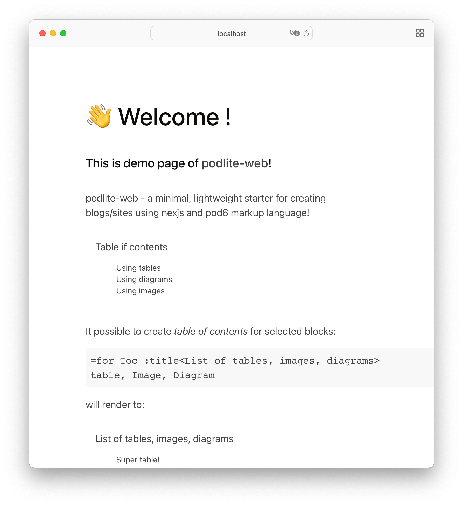
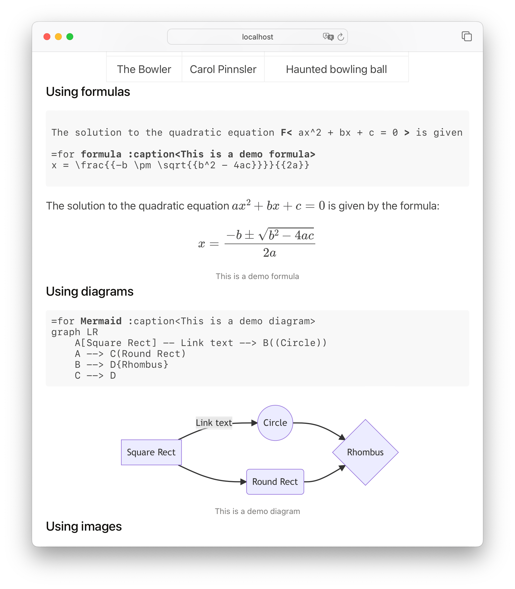

<p align="center">
  <picture>
    <source media="(prefers-color-scheme: dark)" srcset="./assets/podlite-mark-web-dark.svg">
    
  </picture>
</p>
<p align="center"><em>static site generator powered by Podlite markup</em></p>

<p align="center">
  <a href="LICENSE"></a>
</p>

## Quick Start

```sh
yarn && yarn dev
```

Open [http://localhost:3000](http://localhost:3000) — demo site from `pub` directory.

### Using Docker

```sh
docker run -it --rm -v ${PWD}:/app/pub -p 3000:3000 podlite/podlite-web dev
```

Edit `index.pod6` and the page reloads automatically.

### Export to static site

```sh
docker run --rm -v ${PWD}:/app/pub podlite/podlite-web export-zip > site.zip
```

## Screenshots




## Features

- static website generation with Next.js and Podlite markup
- live reload on file save
- embedded Podlite editor with live preview
- `=Mermaid` diagrams, `=picture` images/video, `=toc` table of contents
- `=markdown` blocks for familiar Markdown syntax
- Docker support for zero-config setup
- export to zipped static site

## Examples

```sh
# minimal site
POSTS_PATH='examples/01-minimal' yarn dev

# multi-page with links
POSTS_PATH='examples/02-pages' yarn dev

# blog with notes and React components
POSTS_PATH='examples/03-blog' yarn dev
```

## Advanced Configuration

- custom domain: `SITE_URL=https://example.com`
- timezone: `TZ=Europe/London`
- custom content path: `POSTS_PATH='path/to/content'`

```sh
cd examples/01-minimal
docker run --rm -v ${PWD}:/app/pub -p 3000:3000 \
  -e 'SITE_URL=https://example.com' \
  -e 'TZ=Europe/London' \
  podlite/podlite-web export-zip > site.zip
```

## Themes

A theme bundles header-image styling and layout defaults. Select one with the `:theme<>` attribute on `=begin pod`:

```podlite
=begin pod
= :theme<portrait-avatar>
= :puburl<https://example.com>

=TITLE My Blog
=end pod
```

The themes live in `src/styles/themes/`:

- **portrait-avatar** — round, grayscale header image; for sites with an author photo
- **product** — for emblem or logo headers; sets `#header img { max-width: 51% }`
- **docs** — placeholder for documentation sites
- **minimal** — no overrides; the default look

Theme styles load first, then `:globalStyles<>` (if set) overrides them.

`@import "@Styles/themes/<name>.css"` from `page.styles.css` keeps working; `:theme<>` is the same effect declared on the pod.

## Develop

```sh
# install dependencies
yarn

# run dev server
yarn dev

# export to zip
yarn export-zip > file.zip
```

## Links

<div align="center">
<table border=0><tr><td valign=top><div align="center">

##### specification

</div>

- [Source](https://github.com/podlite/podlite-specs)
- [HTML](https://podlite.org/specification)
- [Discussions](https://github.com/podlite/podlite-specs/discussions)

<div align="center">

##### implementation

</div>

- [Source](https://github.com/podlite/podlite)
- [Changelog](https://github.com/podlite/podlite/releases)
- [Issues](https://github.com/podlite/podlite/issues)

</td><td valign=top><div align="center">

##### publishing

</div>

- [Podlite-web](https://github.com/podlite/podlite-web)
- [How-to article](https://zahatski.com/2022/8/23/1/start-you-own-blog-site-with-podlite-for-web)
- [Changelog](https://github.com/podlite/podlite-web/releases)

</td><td valign=top><div align="center">

##### desktop editor

</div>

- [Releases](https://github.com/podlite/podlite-desktop/releases)
- [Issues](https://github.com/podlite/podlite-desktop/issues)
- Stores: [Mac](https://apps.apple.com/us/app/podlite/id1526511053) · [Windows](https://www.microsoft.com/store/apps/9NVNT9SNQJM8) · [Linux](https://snapcraft.io/podlite)

</td><td valign=top><div align="center">

##### resources

</div>

- [podlite.org](https://podlite.org)
- [pod6.in](https://pod6.in/)
- [github.com/podlite](https://github.com/podlite/)
- [Funding](https://opencollective.com/podlite)

</td></tr></table>
</div>


## Author

Copyright (c) 2022–2026 Alexandr Zahatski

## License

Released under a MIT License.
