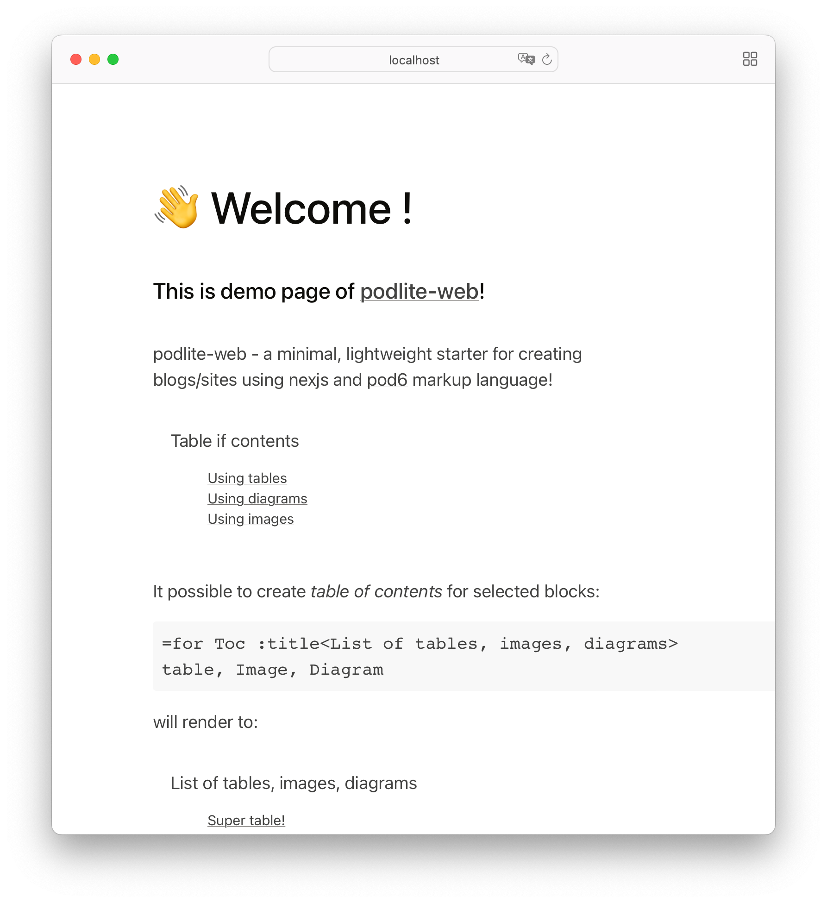
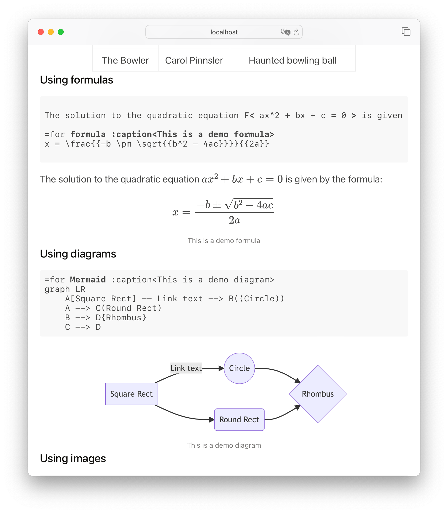

<p align="center">
  <picture>
    <source media="(prefers-color-scheme: dark)" srcset="./assets/podlite-mark-web-dark.svg">
    
  </picture>
</p>
<p align="center"><em>static site generator powered by Podlite markup</em></p>

<p align="center">
  <a href="LICENSE"></a>
</p>

Built with it: [podlite.org](https://podlite.org), which is this project's own site, [axona.app](https://axona.app), and the [Raku knowledge base](https://raku-knowledge-base.podlite.org), which publishes 2274 documents.

## Quick Start

Run it from the directory holding your `index.podlite`:

```sh
docker run -it --rm -v ${PWD}:/app/pub -p 3000:3000 \
  podlite/podlite-web dev ./pub --preset everything
```

Open [http://localhost:3000](http://localhost:3000).

Both the content path and `--preset` are required. See [Presets](#presets). The index is looked up as `index.podlite`, then `index.pod6`; documents may carry either extension.

Content is processed once, when the server starts. Editing a document means restarting the container; the dev server watches the code, not the content.

A site can be one file:

```podlite
=begin pod
= :puburl<https://example.com>

=TITLE My site

=head1 Hello

Written in Podlite, published as HTML.
=end pod
```


### Export to static site

```sh
docker run --rm -v ${PWD}:/app/pub podlite/podlite-web \
  export-zip ./pub -s 'https://example.com' --preset everything > site.zip
```

`export-tgz` writes a gzipped tarball instead; `export` leaves the site in `/app/out`.

## Presets

A preset decides which documents become pages.

- **`everything`** — every document is published. Use it while writing, and for sites that are not a blog.
- **`pubdate`** — only documents carrying a publication date, and only once that date has passed. This is what a blog wants.

There is no default: a run without `--preset` stops with `--preset undefined not valide`.

## Examples

```sh
# minimal site
yarn dev examples/01-minimal --preset everything

# multi-page with links
yarn dev examples/02-pages --preset everything

# blog with notes and React components
yarn dev examples/03-blog --preset pubdate
```

## Advanced Configuration

- custom domain: `-s https://example.com`, or `SITE_URL` in the environment; the flag wins
- timezone: `TZ=Europe/London`
- index file other than the one found by default: `-i path/to/index.podlite`
- file mask: `-g '**/*.{podlite,pod6}'`

```sh
cd examples/01-minimal
docker run --rm -v ${PWD}:/app/pub \
  -e 'TZ=Europe/London' \
  -e 'SITE_URL=https://example.com' \
  podlite/podlite-web export-zip ./pub --preset everything > site.zip
```

## Mounted sources

A site can list the repositories its content comes from. The build clones them before it reads the files. The list goes into `podlite-web.config.js` in the content directory:

```js
module.exports = {
  mounts: [
    { name: 'spec', repo: 'https://github.com/podlite/podlite-specs', ref: 'main' },
    { name: 'spec-v1.0', repo: 'https://github.com/podlite/podlite-specs', ref: 'v1.0' },
    { name: 'spec-v3.0', repo: 'https://github.com/podlite/podlite-specs', ref: 'release/v3.0', required: false },
    { name: 'skills', repo: 'https://github.com/podlite/podlite-skills', ref: 'main', prefix: '/skills' },
  ],
}
```

| field | meaning |
|---|---|
| `name` | the name used elsewhere in the config, and the directory the checkout goes into |
| `repo` | the repository to clone |
| `ref` | the branch or tag to build from. For a repository you do not own, use a tag: a branch can change at any time |
| `required` | true by default. If a required source cannot be prepared, the build stops. With `required: false` the source is skipped and the build prints a warning |
| `prefix` | the part of the site this source answers at. Without it, addresses come from the documents |

Checkouts go into `.mounts/` next to the build, not into the content directory. You build the same site on your own machine, and files from another repository should not end up among your own. If a checkout is already there, the build asks `git ls-remote` for the commit and clones again only if it differs, so a second local build costs almost nothing. `git` has to be on the PATH.

If a required source gives the build no files at all, the build stops. If an optional one does, the build prints a warning and goes on. The first lines of output list what was mounted: name, ref, commit, and whether it came from the network or from the cache.

Two flags belong to this step:

- `--offline` builds from the checkouts already on disk and does not use the network.
- `--mounts-only` prepares the sources and stops. A build server can use it to see which commits the refs point to before it decides to build.

### Versions of a mounted document

Several mounts of the same document can be published as versions of it:

```js
  versions: {
    default: 'v2.0',
    entries: [
      { prefix: 'v1.0', mount: 'spec-v1.0', label: 'v1.0' },
      { prefix: 'v2.0', mount: 'spec', label: 'v2.0' },
      { prefix: 'v3.0', mount: 'spec-v3.0', label: 'v3.0' },
    ],
  },
```

List the entries oldest first. Everything after `default` is not released yet. Everything before it is superseded.

The current version answers at the address written in its own documents, and once more under its prefix. The copy under the prefix has a canonical link to the first address and is not indexed. A version that is not released yet gets `noindex` and stays out of the sitemap. A superseded version keeps its address in both, but stays out of the search on the site. The list of versions is passed to the site as data, so the site draws the version picker itself.

A mount used as a version cannot also have a `prefix`. Two rules for one address would disagree, so the build stops if you set both.

## Site template and components

A site can draw its own page, and keep its React components next to the content without a package of its own.

Declare the template on the root block of `index.podlite`:

```podlite
=begin pod
= :templateFile<src/template.podlite>
=end pod
```

The template renders the whole page, so anything it declares sits above the title. It reaches the page body through the shared component:

```podlite
=useReact {DefaultTemplateComponent} from '@Components/service'
```

Components of your own live beside the content and are imported by path:

```podlite
=useReact SiteNav from './components/sitenav'
```

The import map is keyed by path, so declare each component once: the same name reached through two paths collides. A path is resolved when it starts with `./` or `/`.

## Themes

A theme bundles header-image styling and layout defaults. Select one with the `:theme<>` attribute on `=begin pod`:

```podlite
=begin pod
= :theme<portrait-avatar>
= :puburl<https://example.com>

=TITLE My Blog
=end pod
```

The themes live in `src/styles/themes/`:

- **portrait-avatar** — round, grayscale header image; for sites with an author photo
- **product** — for emblem or logo headers; sets `#header img { max-width: 51% }`
- **docs** — placeholder for documentation sites
- **minimal** — no overrides; the default look

Theme styles load first, then `:globalStyles<>` (if set) overrides them.

`@import "@Styles/themes/<name>.css"` from `page.styles.css` keeps working; `:theme<>` is the same effect declared on the pod.

## Develop

```sh
# install dependencies
yarn

# run dev server against a content directory
yarn dev examples/01-minimal --preset everything

# export to zip
yarn export-zip examples/01-minimal -s 'https://example.com' --preset everything > file.zip
```

A local run attaches the content directory: it adds the directory to `workspaces` in `package.json` and writes an alias into `next.config.js`. Restore both when you are done:

```sh
yarn detach_path
```

## What it does

- turns a folder of Podlite and Markdown documents into a static site
- gives each page a fixed address from `:puburl`, or one built from its publication date
- holds a post back until its publication date has passed, under the `pubdate` preset
- writes `sitemap.xml`, `rss.xml` and `robots.txt`, and builds a search index
- embeds the Podlite editor in a page, with the preview beside it
- renders `=Mermaid` diagrams, `=picture` images and video, `=toc` contents, `=markdown` blocks
- takes a page template and React components kept next to the content, with no package of their own

## What it looks like

The demo site: a post with its table of contents, and the editor embedded in a page.




## Links

<div align="center">
<table border=0><tr><td valign=top><div align="center">

##### specification

</div>

- [Source](https://github.com/podlite/podlite-specs)
- [HTML](https://podlite.org/specification)
- [Discussions](https://github.com/podlite/podlite-specs/discussions)

<div align="center">

##### implementation

</div>

- [Source](https://github.com/podlite/podlite)
- [Changelog](https://github.com/podlite/podlite/releases)
- [Issues](https://github.com/podlite/podlite/issues)

</td><td valign=top><div align="center">

##### publishing

</div>

- [Podlite-web](https://github.com/podlite/podlite-web)
- [Changelog](https://github.com/podlite/podlite-web/releases)

</td><td valign=top><div align="center">

##### desktop editor

</div>

- [Releases](https://github.com/podlite/podlite-desktop/releases)
- [Issues](https://github.com/podlite/podlite-desktop/issues)
- Stores: [Mac](https://apps.apple.com/us/app/podlite/id1526511053) · [Windows](https://www.microsoft.com/store/apps/9NVNT9SNQJM8) · [Linux](https://snapcraft.io/podlite)

</td><td valign=top><div align="center">

##### resources

</div>

- [podlite.org](https://podlite.org)
- [pod6.in](https://pod6.in/)
- [github.com/podlite](https://github.com/podlite/)
- [Funding](https://opencollective.com/podlite)

</td></tr></table>
</div>


## Author

Copyright (c) 2022–2026 Alexandr Zahatski

## License

Released under a MIT License.
