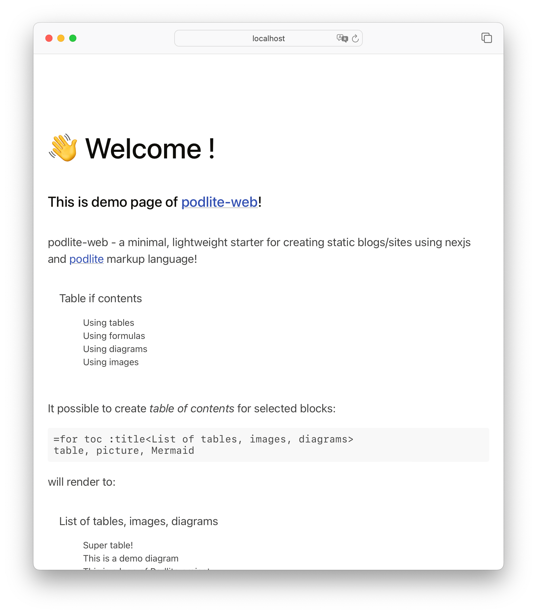
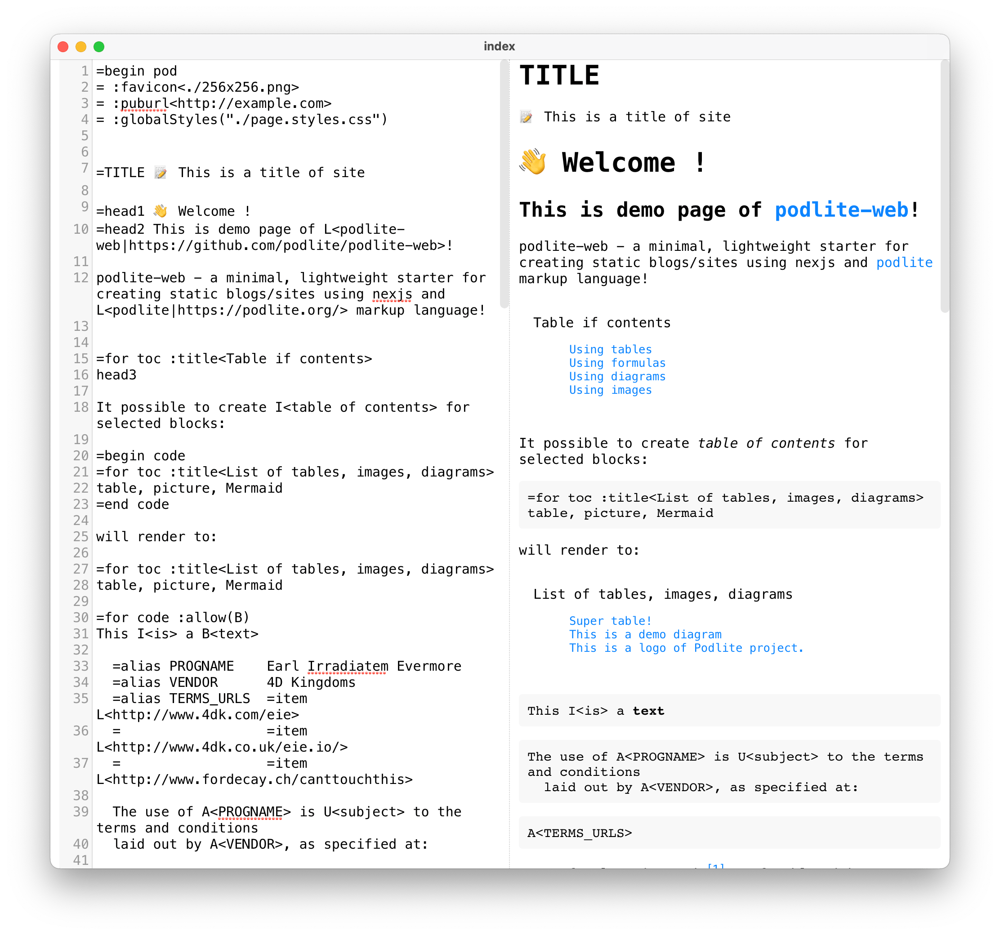

# Podlite-web

A minimal, lightweight starter for creating blogs/sites using nexjs and pod6 markup language!

## QUICK GUIDE


### using yarn

It is recommended to install Yarn through the npm package manager, which comes bundled with Node.js when you install it on your system.

Once you have npm installed you can run the following both to install and upgrade Yarn:

```sh
npm install --global yarn
```
and then: 
```sh
yarn && yarn dev
```
* open link [http://localhost:3000](http://localhost:3000) after

Here is demo page from `pub` directory. 




You can edit pub/*.pod6 files and see changes after save.

All features  like `=Diagram`, `=Image` , `=Toc` for [Podlite editor](https://github.com/podlite/podlite-desktop) is available for podlite-web too:


### using Docker

* make `index.pod6` with the following content:
```
=begin pod
=TITLE Personal blog

🚧 Web site is under construction. 🚧
=end pod
```
run the command:

```sh
docker run -it --rm -v ${PWD}:/app/pub -p 3000:3000  podlite/podlite-web dev
```

* open link [http://localhost:3000](http://localhost:3000)
* after edit `index.pod6` web page will reload automatically


#### Export to zipped static site
```sh
docker run -it --rm -v ${PWD}:/app/pub podlite/podlite-web export-zip > site.zip
```

#### Advance configuration

* using `https://example.com` as domain name
* customize Time Zone
* change default `index.pod6` path to subdirectory

```sh
cd examples/01-minimal
docker run -it --rm -v ${PWD}:/app/pub -p 3000:3000 \
-e 'SITE_URL=https://example.com' \
-e 'TZ=Europe/London' \
podlite/podlite-web export-zip > site.zip
```

## Run examples

### Run minimal site
```sh
POSTS_PATH='examples/01-minimal'  yarn dev
```

### Make links between pages
```sh
POSTS_PATH='examples/02-pages'  yarn dev
```

### Blog with standalone pages and Notes from Diary

This example contains integration with ```React``` components, customize styles and publish notes from Diary document.

```sh
POSTS_PATH='examples/03-blog'  yarn dev
```

## 💻 Develop

### Setup the repo

```sh
yarn
```

### Develop

`yarn dev` will spin up the demosite from `pub` directory and watch changes to the files.

### Export to zip 

```sh
yarn export-zip > file.zip
```

Explore `examples` dir for get more pod6 insights.

thank you!
## License

This project is licensed under the terms of the
[MIT license](/LICENSE).